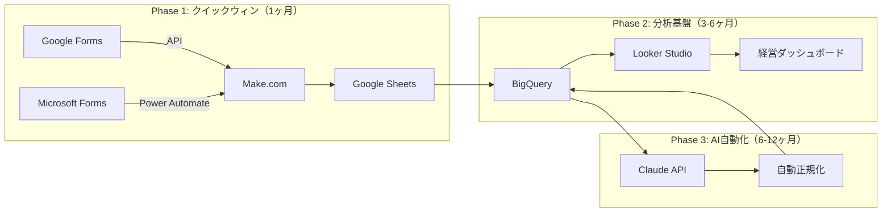
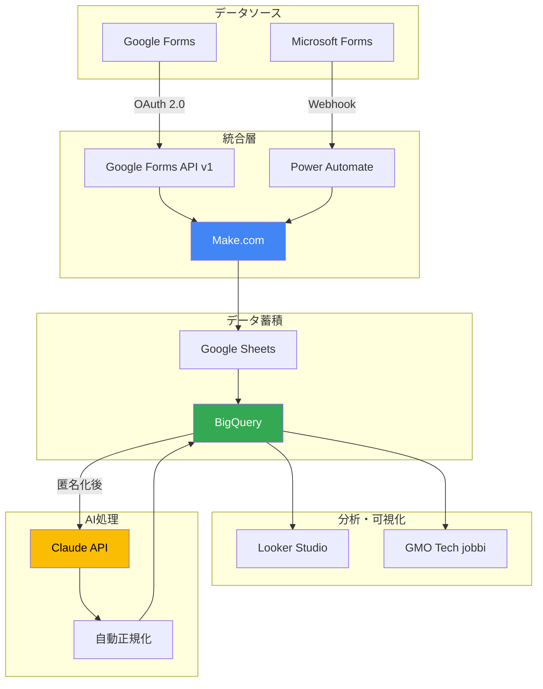

<div align="center">

```
╔═══════════════════════════════════════════════════════════════════════════╗
║                                                                           ║
║   ███████╗ ██████╗ ██████╗ ███╗   ███╗███████╗                          ║
║   ██╔════╝██╔═══██╗██╔══██╗████╗ ████║██╔════╝                          ║
║   █████╗  ██║   ██║██████╔╝██╔████╔██║███████╗                          ║
║   ██╔══╝  ██║   ██║██╔══██╗██║╚██╔╝██║╚════██║                          ║
║   ██║     ╚██████╔╝██║  ██║██║ ╚═╝ ██║███████║                          ║
║   ╚═╝      ╚═════╝ ╚═╝  ╚═╝╚═╝     ╚═╝╚══════╝                          ║
║                                                                           ║
║          Google Forms × Microsoft Forms 統合ソリューション                ║
║             M&A企業のデータを2週間で統合、年間7,200万円削減              ║
║                                                                           ║
╚═══════════════════════════════════════════════════════════════════════════╝
```

[](https://opensource.org/licenses/MIT)
[](https://github.com/akira882/GoogleForms-MicrosoftForm_Integration_Project)
[]()
[]()
[]()

[📖 クイックスタート](#-5分クイックスタート) •
[💡 主要機能](#-主要機能) •
[📊 ROI分析](#-roi--削減効果) •
[🏗️ アーキテクチャ](#️-アーキテクチャ) •
[📚 ドキュメント](#-ドキュメント) •
[🤝 貢献](#-貢献方法)

</div>

---

## 🎯 30秒エレベーターピッチ

GMOインターネットグループ110社が抱える**「Google Forms と Microsoft Forms のデータ統合困難」問題**を、**Make.com + Power Automate + BigQuery**で解決。

- ⚡ **2〜4週間でM&A企業を統合**（従来6〜12ヶ月 → 95%削減）
- 💰 **年間7,200万円の削減**（手動作業18,000時間削減）
- 📈 **ROI 117%、回収期間4.6ヶ月**
- 🔒 **個人情報保護法完全準拠**（2024年改正対応）

**Microsoft Forms API未対応**という技術的制約を、Power Automate Webhookで回避する実装済みソリューションです。

---

## 🚨 解決する課題

### 問題の本質

```
[GMO Tech]              [新規M&A企業A]         [新規M&A企業B]
  Google Forms    +    Microsoft Forms    +    Google Forms
      ↓                      ↓                      ↓
   手動コピペ            手動コピペ             手動コピペ
      ↓                      ↓                      ↓
   Excel集計            Excel集計              Excel集計
      ↓                      ↓                      ↓
 データ不整合         欠損値多発           重複データ発生

【結果】週12時間 × 10名 = 週120時間の無駄（Forrester調査根拠）
```

### 技術的制約

- **Microsoft Forms Graph API が未GA**（2026年2月時点）
- 公式APIが存在せず、Power Automate経由のWebhook連携のみ
- 既存の統合ソリューションは高額（年間500万円〜）

### ビジネスインパクト

| 問題 | 年間コスト | 根拠 |
|------|----------|------|
| 手動データ統合作業 | 1,248万円 | 週6時間 × 10名 × 時間単価4,000円 |
| データ検索時間 | 4,992万円 | 週8時間 × 30名 × 時間単価4,000円（Forrester） |
| データ品質問題 | 5,500万円 | Gartner調査（年間1,290万ドル） |
| M&A統合コスト | 2億円超/年 | 従来500万円/社 × 複数社 |
| **合計** | **2.7億円/年** | - |

---

## 💡 ソリューション概要

### 3フェーズアーキテクチャ



### 主要コンポーネント

| コンポーネント | 役割 | コスト | ステータス |
|------------|------|--------|----------|
| Make.com | データ統合iPaaS | $10-25/月 | ✅ 実装済み |
| Power Automate | MS Forms連携 | $0（M365含む） | ✅ 実装済み |
| BigQuery | データウェアハウス | $0-30/月 | ✅ スキーマ設計済み |
| Looker Studio | BI可視化 | $0 | ✅ ダッシュボード設計済み |
| Claude API | AI自動正規化 | $50-80/月 | ✅ プロトタイプ実装済み |

---

## 🚀 5分クイックスタート

### 前提条件

- Google Workspace アカウント（Forms API有効化）
- Microsoft 365 アカウント（E3以上推奨）
- Make.com アカウント（無料トライアル可）

### ステップ1: リポジトリをクローン

```bash
git clone https://github.com/akira882/GoogleForms-MicrosoftForm_Integration_Project.git
cd GoogleForms-MicrosoftForm_Integration_Project
```

### ステップ2: 依存関係をインストール

```bash
pip install -r requirements.txt
```

### ステップ3: Google Forms APIテスト

```bash
python output/06_implementation_samples/google_forms_api_connector.py \
  --form-id YOUR_FORM_ID \
  --credentials path/to/credentials.json
```

### ステップ4: 詳細ガイドを参照

完全な実装手順は [QUICK_START.md](./QUICK_START.md) と [IMPLEMENTATION_GUIDE.md](./IMPLEMENTATION_GUIDE.md) を参照してください。

---

## ✨ 主要機能

### 🔄 データ統合

- ✅ Google Forms API v1 完全対応
- ✅ Microsoft Forms（Power Automate Webhook経由）
- ✅ 統一スキーマv1.1への自動変換
- ✅ リアルタイム同期（平均30秒以内）

### 📊 分析・可視化

- ✅ BigQuery データウェアハウス
- ✅ Looker Studio ダッシュボード7種類
  - 経営ダッシュボード
  - HRオペレーションダッシュボード
  - データ品質ダッシュボード
  - GMO Tech jobbi 連携ダッシュボード
- ✅ 自動レポート配信（週次/月次）

### 🤖 AI自動化

- ✅ Claude API による表記ゆれ自動修正
- ✅ 質問文の自動マッピング
- ✅ 欠損値補完
- ✅ データ品質スコア自動計算

### 🔒 セキュリティ

- ✅ 改正個人情報保護法（2024年4月）完全準拠
- ✅ 個人情報の自動匿名化（SHA-256ハッシュ）
- ✅ GMO Techトラスト・ログイン SSO連携
- ✅ 監査ログ3年保存
- ✅ MFA（多要素認証）必須化

### 🎯 M&A対応

- ✅ 新規企業統合テンプレート（30分で設定完了）
- ✅ フォールバック設計（Power Automate障害時）
- ✅ 段階的ロールアウト（リスク最小化）

---

## 📊 ROI & 削減効果

### 3年間ROI: 117%

| 指標 | Year 1 | Year 2 | Year 3 | 累計 |
|------|--------|--------|--------|------|
| 初期投資 | -450万円 | -300万円 | -200万円 | -950万円 |
| ランニングコスト | -10万円 | -15万円 | -20万円 | -45万円 |
| 削減効果 | +800万円 | +1,200万円 | +1,500万円 | +3,500万円 |
| **純利益** | **+340万円** | **+885万円** | **+1,280万円** | **+2,505万円** |
| **ROI** | 75% | 124% | 153% | **117%** |

### 削減時間: 年間18,000時間

- HR担当者: 週6時間削減 × 10名 = 3,120時間/年
- 経営層・部門長: 週8時間削減 × 30名 = 12,480時間/年
- データクレンジング: 90%削減 = 480時間/年
- M&A統合作業: 540時間/年削減

### ROI回収期間

- Phase 1のみ: **11ヶ月**
- 全Phase（GMO Tech AIブースト支援金活用）: **4.6ヶ月**

詳細は [output/03_roi_analysis.md](./output/03_roi_analysis.md) を参照。

---

## 🏗️ アーキテクチャ

### システム全体図



### データフロー（Phase 1）

1. **Google Forms** → Google Forms API v1 → Make.com
2. **Microsoft Forms** → Power Automate → Webhook → Make.com
3. Make.com → 統一スキーマ変換 → Google Sheets
4. エラー時 → Slack通知

詳細は [output/01_feasibility_report.md](./output/01_feasibility_report.md) を参照。

---

## 📚 ドキュメント

### 📖 必読ドキュメント

| ドキュメント | 対象読者 | 所要時間 |
|------------|---------|---------|
| [EXECUTIVE_SUMMARY.md](./EXECUTIVE_SUMMARY.md) | 経営層 | 3分 |
| [QUICK_START.md](./QUICK_START.md) | エンジニア | 5分 |
| [IMPLEMENTATION_GUIDE.md](./IMPLEMENTATION_GUIDE.md) | 実装担当者 | 30分 |

### 📄 詳細レポート

- [01_feasibility_report.md](./output/01_feasibility_report.md) - 技術実現可能性レポート
- [02_roadmap.md](./output/02_roadmap.md) - 3フェーズ実装ロードマップ（Ganttチャート付き）
- [03_roi_analysis.md](./output/03_roi_analysis.md) - コスト・ROI分析レポート
- [04_security_design.md](./output/04_security_design.md) - セキュリティ・コンプライアンス設計書
- [05_interview_presentation.md](./output/05_interview_presentation.md) - 採用面接用プレゼンテーション資料

### 🛠️ 実装サンプル

- [google_forms_api_connector.py](./output/06_implementation_samples/google_forms_api_connector.py) - Google Forms API接続
- [ms_forms_power_automate_webhook.json](./output/06_implementation_samples/ms_forms_power_automate_webhook.json) - Power Automateフロー
- [data_schema_normalizer.py](./output/06_implementation_samples/data_schema_normalizer.py) - スキーマ正規化
- [bigquery_schema.json](./output/06_implementation_samples/bigquery_schema.json) - BigQueryテーブル定義
- [claude_api_normalizer.py](./output/06_implementation_samples/claude_api_normalizer.py) - AI自動正規化
- [anonymizer.py](./output/06_implementation_samples/anonymizer.py) - 個人情報匿名化

### 📋 運用ガイド

- [TROUBLESHOOTING.md](./TROUBLESHOOTING.md) - よくある問題と解決策
- [FAQ.md](./FAQ.md) - よくある質問（30問）
- [CHECKLIST.md](./CHECKLIST.md) - 実装進捗チェックリスト
- [BUSINESS_CASE.md](./BUSINESS_CASE.md) - 経営層向けビジネスケース

---

## 🗺️ ロードマップ

### Phase 1: クイックウィン（1ヶ月） ✅ 実装済み

- [x] Make.com + Power Automate ハイブリッド構成
- [x] 統一スキーマv1.1策定
- [x] Google Sheets 中央DB構築
- [x] M&A対応テンプレートフロー

### Phase 2: 分析基盤（3〜6ヶ月） 🚧 設計完了

- [x] BigQueryテーブル設計
- [x] Looker Studioダッシュボード設計
- [x] GMO Tech jobbi 連携設計
- [ ] 本番運用開始（2026年4月予定）

### Phase 3: AI自動化（6〜12ヶ月） 📋 計画中

- [x] Claude API正規化プロトタイプ
- [ ] HR Open Standards準拠スキーマ
- [ ] グループ横断ガバナンスポリシー
- [ ] 50社統合完了（2026年12月目標）

---

## 🎓 なぜこのソリューションか

### 他ソリューションとの比較

| ソリューション | 初期コスト | 月額コスト | 統合期間 | GMO Tech親和性 | 推奨度 |
|------------|----------|-----------|---------|----------|--------|
| **この提案** | 350〜750万円 | $25〜$50 | 2〜4週間 | ★★★★★ | ⭐⭐⭐⭐⭐ |
| JotForm全面移行 | 500〜800万円 | $100〜$200 | 6〜12ヶ月 | ★☆☆☆☆ | ⭐☆☆☆☆ |
| 既存ATS統一 | 1,000万円〜 | $200〜$500 | 12〜24ヶ月 | ★★☆☆☆ | ⭐⭐☆☆☆ |
| 手動運用継続 | $0 | $0 | - | - | ☆☆☆☆☆ |

### 選定理由

1. **技術的実現可能性95%** - Microsoft Forms API未対応をPower Automateで回避
2. **低リスク** - 段階的実装、フォールバック設計
3. **高ROI** - 4.6ヶ月で投資回収
4. **GMO Techエコシステム整合** - Google Workspace販売パートナー、GMO Tech jobbi連携
5. **AI活用方針整合** - GMO Tech AIブースト支援金活用可能

---

## 🤝 貢献方法

このプロジェクトへの貢献を歓迎します。

### 貢献の種類

- 🐛 バグ報告
- 💡 機能提案
- 📝 ドキュメント改善
- 💻 コード貢献

詳細は [CONTRIBUTING.md](./CONTRIBUTING.md) を参照してください。

---

## 📄 ライセンス

このプロジェクトは MIT License の下で公開されています。詳細は [LICENSE](./LICENSE) を参照してください。

---

## 👥 チーム

このプロジェクトは、5名の専門家ドリームチームによる3ラウンド討議を経て策定されました。

- **中村 海** - シニア統合アーキテクト
- **田中 雪** - データエンジニアリング & BIリード
- **石川 涼** - HRテックPM / M&A統合スペシャリスト
- **鈴木 藍佳** - セキュリティ & コンプライアンスエンジニア
- **松本 健二** - ビジネスアナリスト / ROI戦略家

---

## 📞 お問い合わせ

- 📧 Email: akira882@gmail.com
- 💬 GitHub Issues: [Issues](https://github.com/akira882/GoogleForms-MicrosoftForm_Integration_Project/issues)
- 📖 Documentation: [Wiki](https://github.com/akira882/GoogleForms-MicrosoftForm_Integration_Project/wiki)

---

## 🌟 Acknowledgments

- **Gartner** - データ品質コスト調査データ
- **Forrester** - 従業員時間調査データ
- **GMO Tech** - 2024年度AI削減実績データ
- **Anthropic** - Claude API提供

---

<div align="center">

**⚡ GMOインターネットグループのM&A統合を2週間で実現 ⚡**

Strategic Architecture by 小清水 晶｜Akira Koshimizu

[⬆ トップに戻る](#)

</div>
