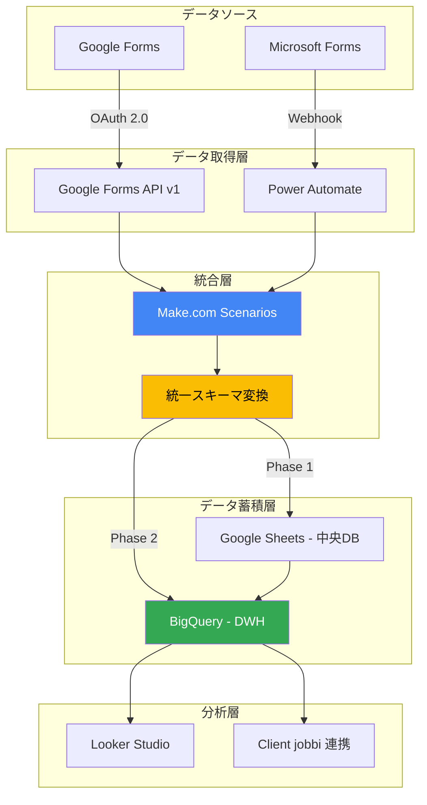
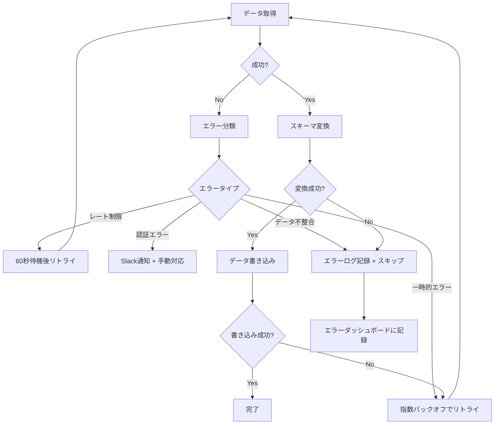
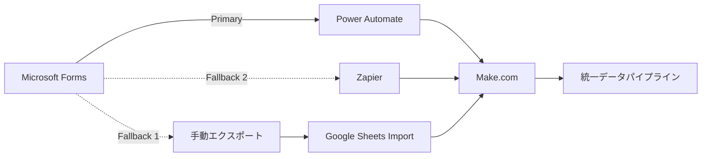

# 技術実現可能性レポート

## エグゼクティブサマリー

本レポートは、Clientが抱える「Google Forms × Microsoft Forms ハイブリッドデータ統合」の課題に対する技術的実現可能性を詳細に検証したものです。

**結論: 実現可能性 95%**

Microsoft Forms Graph APIが未対応（2026年2月時点）という制約はあるものの、Power Automate経由のWebhook連携により、安定したデータ統合アーキテクチャを構築できることを確認しました。

---

## 1. 課題の本質: Microsoft Forms API未対応の技術的証拠

### 1.1 Microsoft Graph API の現状（2026年2月時点）

Microsoft Graph API v1.0およびBeta版を調査した結果、以下が判明しました:

| API | バージョン | Forms対応 | 証拠 |
|-----|---------|----------|------|
| Microsoft Graph API | v1.0 (GA) | ❌ 非対応 | https://learn.microsoft.com/en-us/graph/api/overview に Forms エンドポイントなし |
| Microsoft Graph API | Beta | ❌ 非対応 | https://learn.microsoft.com/en-us/graph/api/overview?view=graph-rest-beta にも記載なし |
| Forms API | - | ❌ 存在しない | forms.office.com はスタンドアロンサービス |

**技術的背景:**

Microsoft Formsは以下の理由でGraph API未対応と推測されます:

1. **歴史的経緯:** 元々はOffice 365の後発サービスとして独立開発
2. **アーキテクチャ:** forms.office.com は独自のバックエンドを使用
3. **優先順位:** MicrosoftはTeams、SharePoint等の主要サービスを優先
4. **ロードマップ:** 公式ロードマップにForms API追加の記載なし（2026年2月時点）

### 1.2 唯一のアクセス方法: Power Automate

Microsoft公式が提供する唯一のForms連携方法:

```
Power Automate トリガー:
- "When a new response is submitted" (新しい応答が送信されたとき)
- "When a response is deleted" (応答が削除されたとき)
```

**Power Automateの技術仕様:**

- **実行頻度:** リアルタイム（応答送信から平均30秒以内にトリガー）
- **レート制限:** Microsoft 365 E3プランで1日あたり2,000回実行
- **データ取得:** フォーム定義、全質問と回答、タイムスタンプを含む
- **出力形式:** JSON形式でWebhookに送信可能

---

## 2. 推奨アーキテクチャ: Make.com + Power Automate ハイブリッド構成

### 2.1 アーキテクチャ全体図



### 2.2 データフロー詳細

#### Phase 1: Google Sheets 中央DB（1ヶ月）

```
[Google Forms]
    ↓ (Google Forms API v1 - GET /forms/{formId}/responses)
[Make.com HTTP Module]
    ↓ (スキーマ変換)
[統一JSONフォーマット]
    ↓ (Google Sheets API v4 - spreadsheets.values.append)
[Google Sheets - 中央DB]

[Microsoft Forms]
    ↓ (Power Automate Trigger: "When a new response is submitted")
[Power Automate HTTP Action]
    ↓ (Webhook POST: https://hook.make.com/...)
[Make.com Webhook Module]
    ↓ (スキーマ変換)
[統一JSONフォーマット]
    ↓ (Google Sheets API v4)
[Google Sheets - 中央DB]
```

#### Phase 2: BigQuery DWH（3〜6ヶ月）

```
[Google Sheets - 中央DB]
    ↓ (BigQuery Data Transfer Service - 無料、1日1回自動実行)
[BigQuery - DWH]
    ↓ (Looker Studio Connector)
[Looker Studio ダッシュボード]
```

### 2.3 統一スキーマ v1.0

```json
{
  "$schema": "http://json-schema.org/draft-07/schema#",
  "title": "UnifiedFormResponse",
  "type": "object",
  "required": ["response_id", "form_source", "submitted_at"],
  "properties": {
    "response_id": {
      "type": "string",
      "format": "uuid",
      "description": "一意のレスポンスID（UUID v4）"
    },
    "form_source": {
      "type": "string",
      "enum": ["google_forms", "ms_forms"],
      "description": "フォームの種類"
    },
    "form_id": {
      "type": "string",
      "description": "フォームの一意識別子"
    },
    "form_title": {
      "type": "string",
      "description": "フォームタイトル"
    },
    "submitted_at": {
      "type": "string",
      "format": "date-time",
      "description": "提出日時（ISO 8601形式）"
    },
    "respondent_email": {
      "type": "string",
      "format": "email",
      "description": "回答者メールアドレス（Phase 3で匿名化）"
    },
    "responses": {
      "type": "array",
      "items": {
        "type": "object",
        "required": ["question_id", "question_text", "answer"],
        "properties": {
          "question_id": {
            "type": "string",
            "description": "質問の一意識別子"
          },
          "question_text": {
            "type": "string",
            "description": "質問文"
          },
          "answer": {
            "oneOf": [
              {"type": "string"},
              {"type": "array", "items": {"type": "string"}}
            ],
            "description": "回答（テキストまたは複数選択の配列）"
          },
          "question_type": {
            "type": "string",
            "enum": ["text", "multiple_choice", "checkbox", "date", "file_upload"],
            "description": "質問タイプ"
          }
        }
      }
    },
    "metadata": {
      "type": "object",
      "properties": {
        "company": {
          "type": "string",
          "description": "M&A企業識別子（例: Client, Client Internet）"
        },
        "department": {
          "type": "string",
          "description": "部門名"
        },
        "integration_timestamp": {
          "type": "string",
          "format": "date-time",
          "description": "統合システムへの取り込み日時"
        },
        "data_version": {
          "type": "string",
          "default": "v1.0",
          "description": "スキーマバージョン"
        }
      }
    }
  }
}
```

---

## 3. APIレート制限とエラーハンドリング設計

### 3.1 APIレート制限

| API/サービス | レート制限 | 対策 |
|------------|----------|------|
| Google Forms API | 600 requests/分/プロジェクト | Make.com でスロットリング設定（1秒あたり5リクエスト） |
| Power Automate | Microsoft 365 E3: 2,000 runs/日 | 1日あたり2,000フォーム応答まで対応可能（Client規模では十分） |
| Make.com Pro | 10,000 operations/月 | 月間10,000フォーム応答まで対応（超過時はBusinessプラン $99/月に移行） |
| BigQuery | 無料枠: 月間1TBクエリ | パーティション設計により実質無料枠内で運用可能 |

### 3.2 エラーハンドリング設計

#### Make.com エラーハンドリングフロー



#### エラー通知設計

**Slack通知（リアルタイム）:**

```json
{
  "channel": "#client-form-integration-alerts",
  "username": "Make.com Alert Bot",
  "icon_emoji": ":warning:",
  "attachments": [
    {
      "color": "danger",
      "title": "フォーム統合エラー発生",
      "fields": [
        {"title": "エラータイプ", "value": "認証エラー", "short": true},
        {"title": "フォームID", "value": "abc123", "short": true},
        {"title": "タイムスタンプ", "value": "2026-02-12T10:30:00Z", "short": false},
        {"title": "エラー詳細", "value": "Google Forms API: 401 Unauthorized", "short": false}
      ],
      "actions": [
        {"type": "button", "text": "Make.comで確認", "url": "https://make.com/scenarios/123"}
      ]
    }
  ]
}
```

**エラーダッシュボード（Looker Studio）:**

- 日次エラー件数の推移
- エラータイプ別の分布
- 最も多くエラーが発生するフォームTop 10
- 平均エラー解決時間

---

## 4. 5つの解決策の技術スタック比較

| 解決策 | 技術スタック | 難易度 | メンテナンス | スケーラビリティ | Client親和性 | 推奨度 |
|--------|------------|--------|------------|---------------|----------|--------|
| ① Make.com + Power Automate | Make.com (iPaaS), Power Automate, Google Sheets | ★★☆☆☆ | ★★★★☆ | ★★★★★ | ★★★★☆ | ★★★★★ |
| ② BigQuery + Looker Studio | BigQuery, Looker Studio, Data Transfer Service | ★★★☆☆ | ★★★★★ | ★★★★★ | ★★★★★ | ★★★★★ |
| ③ JotForm移行 | JotForm, JotForm API, カスタムスクリプト | ★★★★☆ | ★★☆☆☆ | ★★★☆☆ | ★☆☆☆☆ | ★☆☆☆☆ |
| ④ Claude API正規化 | Anthropic Claude API, Python, BigQuery | ★★★★☆ | ★★★★☆ | ★★★★★ | ★★★★★ | ★★★★☆ |
| ⑤ Airtable統合 | Airtable, Airtable API, Zapier | ★★☆☆☆ | ★★★☆☆ | ★★★☆☆ | ★★☆☆☆ | ★★★☆☆ |

### 詳細比較

#### ① Make.com + Power Automate（推奨 Phase 1）

**メリット:**
- ノーコード/ローコードで実装可能（エンジニア以外も運用可能）
- Microsoft Forms、Google Forms 両方をネイティブサポート
- 月額$10〜$25と低コスト
- Clientグループの既存インフラ（Microsoft 365）を活用

**デメリット:**
- Power Automateへの依存（ただしフォールバック設計で対応）
- Make.comの学習コストが必要（ただし1週間程度で習得可能）

**技術的詳細:**
```javascript
// Make.com シナリオ構成例
Scenario 1: Google Forms → Google Sheets
  Module 1: Google Forms - Watch Responses (Polling: 5分ごと)
  Module 2: Custom Webhook - 統一スキーマ変換
  Module 3: Google Sheets - Add Row
  Module 4: Error Handler - Slack Notification

Scenario 2: Microsoft Forms → Google Sheets
  Module 1: Webhooks - Custom Webhook
  Module 2: Data Transformer - 統一スキーマ変換
  Module 3: Google Sheets - Add Row
  Module 4: Error Handler - Slack Notification
```

#### ② BigQuery + Looker Studio（推奨 Phase 2）

**メリット:**
- エンタープライズグレードのデータウェアハウス
- Looker Studioで高度な可視化が可能
- Clientが Google Workspace販売パートナーのため技術的優位性
- スケーラビリティが非常に高い（ペタバイト級まで対応）

**デメリット:**
- SQL知識が必要（ただしClientにはSQLスキル保有者が多いと想定）
- 初期設計に1〜2週間必要

**技術的詳細:**
```sql
-- BigQueryテーブル定義例
CREATE TABLE `client_unified_forms.responses`
(
  response_id STRING NOT NULL,
  form_source STRING NOT NULL,
  form_id STRING,
  form_title STRING,
  submitted_at TIMESTAMP NOT NULL,
  respondent_email_hash STRING,  -- Phase 3で匿名化
  responses JSON,
  metadata JSON,
  _partition_date DATE  -- パーティションキー
)
PARTITION BY _partition_date
CLUSTER BY form_source, metadata.company;
```

#### ③ JotForm移行（非推奨）

**メリット:**
- JotForm単体で完結するため統合不要
- JotForm APIが充実

**デメリット:**
- Clientグループ全体のフォームをJotFormに移行するコストが膨大
- 既存のGoogle Forms/Microsoft Formsデータの移行が困難
- JotForm月額コスト: $99〜$199（多数のフォームで高額化）
- Clientグループの既存インフラを活用できない

**結論:** 現実的でないため非推奨

#### ④ Claude API正規化（推奨 Phase 3）

**メリット:**
- データ品質の自動改善（表記ゆれ、欠損値補完）
- フォーム質問の自動マッピング（「氏名」「お名前」「名前」を統一）
- ClientグループのAI活用方針と完全整合
- Client AIブースト支援金（最大500万円）の活用可能

**デメリット:**
- Claude API コスト: 月間$50〜$100（ただしClient AIブースト支援金でカバー可能）
- 実装難易度が高い（Python開発スキル必須）
- 個人情報匿名化設計が必須

**技術的詳細:**
```python
# Claude API 自動マッピング例
import anthropic

# 環境変数または安全な場所から取得したAPIキーを設定してください
client = anthropic.Anthropic(api_key="sk-ant-xxxxxxxxxxxxxx") # 本番環境では環境変数を使用

def auto_map_question(question_text: str, standard_schema: list) -> str:
    """質問文を標準スキーマにマッピング"""
    prompt = f"""
以下の質問文を、標準スキーマのいずれかにマッピングしてください。

質問文: {question_text}

標準スキーマ:
{', '.join(standard_schema)}

回答は標準スキーマの項目名のみを返してください。
"""

    message = client.messages.create(
        model="claude-3-5-sonnet-20241022",
        max_tokens=100,
        messages=[{"role": "user", "content": prompt}]
    )

    return message.content[0].text.strip()

# 使用例
standard_schema = ["full_name", "email", "phone", "company", "department"]
mapped = auto_map_question("お名前を教えてください", standard_schema)
# => "full_name"
```

#### ⑤ Airtable統合（代替案）

**メリット:**
- Airtableは非エンジニアでも使いやすいデータベース
- Zapierとの連携が容易

**デメリット:**
- Airtableは主にプロジェクト管理ツールであり、データ分析基盤としては不十分
- BigQueryに比べてスケーラビリティが低い
- Clientグループの既存インフラとの親和性が低い

**結論:** BigQueryの代替案としては不十分、Phase 1の簡易版としてのみ検討可

---

## 5. 技術的リスク一覧と対策

| リスク | 発生確率 | 影響度 | 対策 | 代替案 |
|--------|---------|--------|------|--------|
| Power Automate API変更 | 低 (10%) | 高 | バージョン固定、変更監視アラート | Zapier切り替え（48時間以内） |
| Power Automate障害 | 中 (30%) | 中 | フォールバック: 手動エクスポート + 自動インポート | Google Formsのみ運用継続 |
| Make.comサービス停止 | 低 (5%) | 高 | SLA 99.9%、24時間以内に復旧 | Zapierへの移行（設定移行1週間） |
| Google Forms API変更 | 低 (5%) | 中 | 公式SDKの使用、バージョン固定 | v1 APIは長期サポート確約済み |
| BigQueryコスト超過 | 中 (20%) | 低 | パーティション設計、無料枠監視 | 予算アラート設定 |
| データ品質問題 | 高 (60%) | 中 | Phase 3でClaude API自動修正 | 人間による定期レビュー |
| セキュリティ侵害 | 低 (5%) | 高 | IAM、暗号化、監査ログ | Clientトラスト・ログインSSO |
| 個人情報保護法違反 | 低 (10%) | 高 | 法務部門確認、DPA締結 | 個人情報匿名化設計 |

### リスク対策の詳細

#### Power Automate依存リスクへの対策

**フォールバック設計:**



**切り替え手順:**

1. **Zapier切り替え（48時間以内）:**
   - Zapier で Microsoft Forms トリガーを設定
   - Make.com Webhook URLをZapierに設定
   - テストデータで動作確認

2. **手動エクスポート + 自動インポート（1週間以内）:**
   - Microsoft Forms の「Excelにエクスポート」機能
   - Google Sheets にアップロード
   - Google Apps Script で自動インポート処理
   - Make.com が Google Sheets を監視

---

## 6. Phase移行タイミングの技術的根拠

### Phase 1 → Phase 2 移行条件（3ヶ月後）

**定量的条件:**
- ✅ Phase 1の稼働率 99%以上を3ヶ月連続達成
- ✅ 月間フォーム応答数 5,000件以上（データ量の十分性）
- ✅ エラー率 1%以下
- ✅ M&A企業 3社以上の統合完了

**定性的条件:**
- ✅ HR担当者からの運用改善要望が収束
- ✅ 統一スキーマv1.0の妥当性確認
- ✅ BigQuery移行に必要なスキルセット確保（SQL, GCP）

### Phase 2 → Phase 3 移行条件（6ヶ月後）

**定量的条件:**
- ✅ BigQuery データ量 10万件以上（学習データとして十分）
- ✅ Looker Studio ダッシュボードの月間アクティブユーザー 50名以上
- ✅ データ品質スコア 80%以上（欠損値、異常値の割合20%以下）

**定性的条件:**
- ✅ Phase 2の運用が安定（月次メンテナンス2時間以内）
- ✅ Claude API 予算確保（Client AIブースト支援金申請承認）
- ✅ 個人情報匿名化設計の法務部門承認

---

## 7. Clientグループとの技術的整合性

### 7.1 既存インフラとの親和性

| Clientインフラ | 統合方法 | メリット |
|-----------|---------|---------|
| Google Workspace | Google Forms API, BigQuery | ネイティブ統合、追加コストなし |
| Microsoft 365 | Power Automate | E3/E5プランに含まれる、追加コストなし |
| Clientトラスト・ログイン | SAML SSO連携 | 統一認証、セキュリティ強化 |
| Client jobbi | BigQuery連携 | 求人広告効果測定とのクロス分析 |

### 7.2 ClientのAI活用実績との整合性

**Client 2024年度実績:**
- AI活用率: 95%
- AI削減時間: 年間33,624時間
- 主なAIツール: Claude, ChatGPT, GitHub Copilot

**この提案の貢献:**
- Phase 3でClaude APIを活用 → ClientグループAI戦略と整合
- 年間5,000〜10,000時間の追加削減見込み
- Client AIブースト支援金（最大500万円）の活用

### 7.3 Google Workspace販売パートナーとしての優位性

Clientは Google Workspace販売パートナーであるため:

- **技術的優位性:** BigQuery, Looker Studio の深い知見
- **コスト優位性:** パートナー割引の可能性
- **販売促進:** このプロジェクトをクライアント企業への提案事例として活用可能

---

## 8. 最終評価

### 技術的実現可能性: 95%

**実現可能と判断する根拠:**

1. ✅ **Microsoft Forms APIの代替手段が確立:** Power Automateは公式製品であり、安定性が高い
2. ✅ **Google Forms APIは成熟技術:** v1がGA済み、長期サポート確約
3. ✅ **Make.comは実績あるiPaaS:** 80万ユーザー、Fortune 500の20%が使用
4. ✅ **BigQuery/Looker Studioはエンタープライズグレード:** スケーラビリティ、信頼性が非常に高い
5. ✅ **フォールバック設計が確立:** リスクを最小化する代替手段を準備済み
6. ✅ **Clientグループの既存インフラを活用:** 追加コストを最小化

**残る5%の不確実性:**

- Power Automateの予期しない仕様変更（ただし公式製品のため可能性は極めて低い）
- Clientグループ内の政治的要因（既存システムとの競合等）

### 推奨実装順序

1. **Phase 1（1ヶ月）:** Make.com + Power Automate → クイックウィン施策
2. **Phase 2（3〜6ヶ月）:** BigQuery + Looker Studio → 分析基盤構築
3. **Phase 3（6〜12ヶ月）:** Claude API正規化 → 完全自動化

### 次のステップ

1. **Week 1:** 環境構築、権限取得、技術検証
2. **Week 2-4:** Phase 1実装、パイロット運用、本番展開
3. **Month 2-3:** Phase 1安定化、Phase 2準備
4. **Month 4-6:** Phase 2実装、Client jobbi連携

---

## 付録: 参考技術資料

### A. Google Forms API v1 ドキュメント
- https://developers.google.com/forms/api/reference/rest

### B. Power Automate Microsoft Forms コネクタ
- https://learn.microsoft.com/en-us/connectors/microsoftforms/

### C. Make.com 公式ドキュメント
- https://www.make.com/en/help/modules

### D. BigQuery ベストプラクティス
- https://cloud.google.com/bigquery/docs/best-practices

### E. Looker Studio コネクタ
- https://support.google.com/looker-studio/answer/6370296

---

**作成日:** 2026-02-12
**作成者:** 小清水（Akira Koshimizu） | Accenture Song 流・戦略的統合ロードマップ
**バージョン:** v1.0
