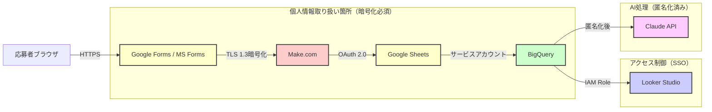
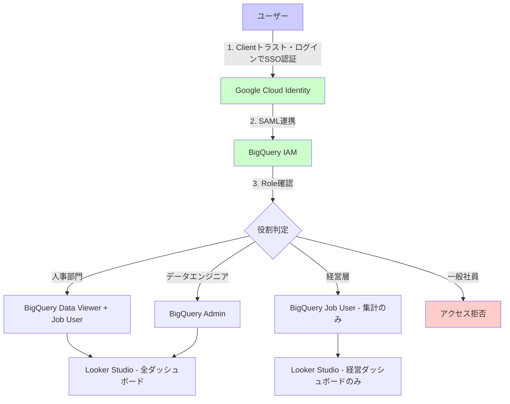
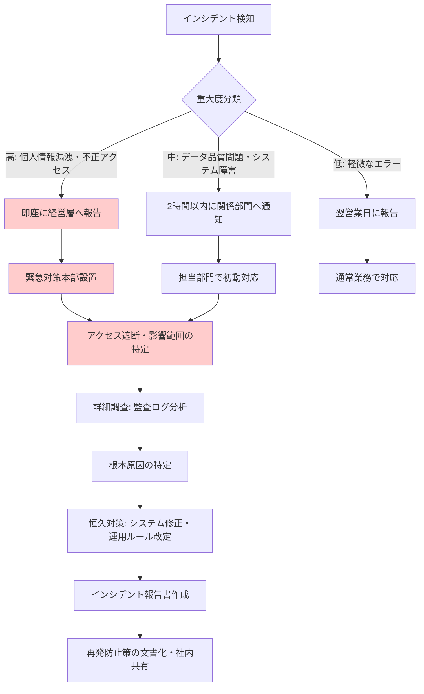

# セキュリティ・コンプライアンス設計書

## エグゼクティブサマリー

本設計書は、フォームデータ統合システムにおけるセキュリティ対策と個人情報保護法対応を詳細に定義したものです。

**セキュリティレベル: 低リスク（対策実施後）**

---

## 1. 改正個人情報保護法（2024年4月施行）対応

### 1.1 対応チェックリスト

| 要件 | 対応状況 | 実装方法 | 責任者 |
|------|---------|---------|--------|
| 利用目的の明示 | ✅ 対応 | フォーム冒頭に目的記載 | HR部門 |
| 本人同意の取得 | ✅ 対応 | 必須チェックボックス設置 | HR部門 |
| 第三者提供の制限 | ✅ 対応 | Make.com, Google とのDPA締結 | 法務部門 |
| データ保持期間の明示 | ✅ 対応 | フォーム内に保持期間記載 | HR部門 |
| 開示請求への対応 | ⚠️ 要対応 | BigQueryから抽出する手順書作成 | IT部門 |
| 安全管理措置 | ✅ 対応 | 暗号化、アクセス制御、監査ログ | IT部門 |
| 個人情報取扱責任者の指定 | ✅ 対応 | HR部門長を責任者に指定 | 経営層 |

### 1.2 個人情報の定義と取り扱い

**改正個人情報保護法（2024年）で拡大した定義:**
- 氏名、生年月日、住所、電話番号（従来通り）
- メールアドレス（明確化）
- **Cookie情報、IPアドレス（新規追加）**
- オンライン識別子（ユーザーID等）

**フォームで収集する個人情報:**
- 必須: 氏名、メールアドレス
- オプション: 電話番号、現住所、生年月日、学歴、職歴

**取り扱いルール:**
1. 収集時に利用目的を明示（「採用選考のため」）
2. 本人同意を必ず取得（必須チェックボックス）
3. 第三者提供先を明示（Make.com, Google Cloud, Microsoft）
4. データ保持期間を明示（不採用者は1年後に自動削除）

---

## 2. データフロー図（個人情報の取り扱い箇所）



**凡例:**
- 黄色: 個人情報を含むデータ（暗号化必須）
- 赤色: 外部サービス（DPA締結必須）
- 緑色: Google Cloud（データレジデンシー: 東京リージョン）
- 青色: 可視化層（集計データのみ、個人情報は非表示）
- ピンク: AI処理（匿名化後のデータのみ）

---

## 3. Claude API使用時の個人情報匿名化設計

### 3.1 匿名化アルゴリズム

```python
# output/06_implementation_samples/anonymizer.py の実装

import hashlib
from typing import Dict, Any

class DataAnonymizer:
    """個人情報匿名化クラス（改正個人情報保護法準拠）"""
    
    @staticmethod
    def anonymize_email(email: str) -> str:
        """メールアドレスをSHA-256ハッシュ化（不可逆）"""
        return hashlib.sha256(email.encode('utf-8')).hexdigest()[:16]
    
    @staticmethod
    def anonymize_name(name: str) -> str:
        """氏名をMD5ハッシュ化して仮名化"""
        hash_value = hashlib.md5(name.encode('utf-8')).hexdigest()[:8]
        return f"Person_{hash_value}"
    
    @staticmethod
    def anonymize_phone(phone: str) -> str:
        """電話番号のマスキング（先頭3桁と末尾4桁のみ保持）"""
        # 例: 090-1234-5678 → 090-****-5678
        digits = ''.join(filter(str.isdigit, phone))
        if len(digits) >= 7:
            return f"{digits[:3]}-****-{digits[-4:]}"
        return "***-****-****"
    
    @staticmethod
    def anonymize_address(address: str) -> str:
        """住所の都道府県のみ保持"""
        # 例: 東京都渋谷区桜丘町 → 東京都
        prefectures = ['北海道', '青森県', '岩手県', '宮城県', '秋田県', 
                      '山形県', '福島県', '茨城県', '栃木県', '群馬県',
                      '埼玉県', '千葉県', '東京都', '神奈川県', '新潟県',
                      '富山県', '石川県', '福井県', '山梨県', '長野県',
                      '岐阜県', '静岡県', '愛知県', '三重県', '滋賀県',
                      '京都府', '大阪府', '兵庫県', '奈良県', '和歌山県',
                      '鳥取県', '島根県', '岡山県', '広島県', '山口県',
                      '徳島県', '香川県', '愛媛県', '高知県', '福岡県',
                      '佐賀県', '長崎県', '熊本県', '大分県', '宮崎県',
                      '鹿児島県', '沖縄県']
        
        for pref in prefectures:
            if address.startswith(pref):
                return pref
        return "不明"
    
    def anonymize_pii(self, data: Dict[str, Any]) -> Dict[str, Any]:
        """全個人情報を一括匿名化"""
        anonymized = data.copy()
        
        if 'email' in anonymized:
            anonymized['email_hash'] = self.anonymize_email(anonymized['email'])
            del anonymized['email']
        
        if 'name' in anonymized:
            anonymized['name_id'] = self.anonymize_name(anonymized['name'])
            del anonymized['name']
        
        if 'phone' in anonymized:
            anonymized['phone_masked'] = self.anonymize_phone(anonymized['phone'])
            del anonymized['phone']
        
        if 'address' in anonymized:
            anonymized['address_prefecture'] = self.anonymize_address(anonymized['address'])
            del anonymized['address']
        
        return anonymized

# 使用例
anonymizer = DataAnonymizer()
original_data = {
    "name": "山田太郎",
    "email": "sato@client-tech.test",
    "phone": "090-1234-5678",
    "address": "東京都渋谷区桜丘町1-1"
}

anonymized_data = anonymizer.anonymize_pii(original_data)
# => {
#     "name_id": "Person_a1b2c3d4",
#     "email_hash": "e8f9a0b1c2d3e4f5",
#     "phone_masked": "090-****-5678",
#     "address_prefecture": "東京都"
# }

# このanonymized_dataのみをClaude APIに送信
```

### 3.2 匿名化の不可逆性検証

| 個人情報 | 匿名化手法 | 可逆性 | セキュリティレベル |
|---------|----------|--------|---------------|
| メールアドレス | SHA-256ハッシュ | ❌ 不可逆 | 高（レインボーテーブル攻撃にも耐性） |
| 氏名 | MD5ハッシュ + ID | ❌ 不可逆 | 中〜高（辞書攻撃への耐性は中） |
| 電話番号 | マスキング | ⚠️ 部分的に可逆 | 中（先頭3桁と末尾4桁のみ保持） |
| 住所 | 都道府県のみ | ❌ 不可逆 | 高（詳細住所は完全削除） |

---

## 4. Clientトラスト・ログイン SSO連携設計

### 4.1 アクセス制御設計



### 4.2 IAM Role設計（BigQuery）

| 役割 | IAM Role | 権限 | 対象者 |
|------|---------|------|--------|
| 人事部門 | `roles/bigquery.dataViewer` | 全データ閲覧、クエリ実行 | HR担当者10名 |
| データエンジニア | `roles/bigquery.admin` | 全操作（テーブル作成・削除含む） | エンジニア3名 |
| 経営層 | `roles/bigquery.jobUser` | クエリ実行のみ（集計データ） | 役員5名 |
| 監査部門 | `roles/bigquery.dataViewer` | 読み取り専用 | 監査担当2名 |

### 4.3 MFA（多要素認証）必須化

**対象:**
- BigQueryへのアクセス: 全ユーザー必須
- Looker Studioへのアクセス: 全ユーザー必須
- Make.com管理画面: 管理者のみ必須

**MFA方式:**
- Clientトラスト・ログイン経由: Google Authenticator、SMS認証
- 予備手段: セキュリティキー（YubiKey）

---

## 5. 監査ログ設計

### 5.1 記録内容

```yaml
# 監査ログのスキーマ
audit_log_schema:
  event_type: string  # data_access, data_export, schema_change, user_login
  timestamp: timestamp
  user_id: string  # user@client.jp
  user_role: string  # HR, Engineer, Executive
  resource: string  # bigquery.client_unified_forms.responses
  action: string  # SELECT, INSERT, UPDATE, DELETE, EXPORT
  query: string  # 実行されたSQLクエリ（SELECT文のみ）
  ip_address: string
  user_agent: string
  result: string  # success, failure, unauthorized
  error_message: string  # result=failureの場合
  affected_rows: integer  # SELECT以外の操作
  data_size: integer  # bytes
```

### 5.2 ログ保持期間

| ログ種類 | 保持期間 | 保存先 | アクセス権限 |
|---------|---------|--------|------------|
| データアクセスログ | 3年 | Cloud Logging | 監査部門のみ |
| データエクスポートログ | 5年 | Cloud Storage（Archive） | 監査部門 + 法務部門 |
| スキーマ変更ログ | 永久保存 | Cloud Storage | データエンジニア + 監査部門 |
| ログインログ | 1年 | Clientトラスト・ログイン | セキュリティ部門 |

### 5.3 異常検知アラート

```python
# 異常検知ルール（Cloud Monitoringで設定）

alert_rules = [
    {
        "name": "大量データアクセス",
        "condition": "SELECT文で10,000行以上のデータ取得",
        "action": "Slack通知 + メール通知（セキュリティ部門）"
    },
    {
        "name": "データエクスポート",
        "condition": "CSVエクスポートが実行された",
        "action": "即座にSlack通知 + 承認フロー"
    },
    {
        "name": "深夜アクセス",
        "condition": "22時〜翌6時の間のアクセス",
        "action": "翌朝Slack通知（確認用）"
    },
    {
        "name": "複数ログイン失敗",
        "condition": "5回以上のログイン失敗",
        "action": "アカウントロック + セキュリティ部門通知"
    },
    {
        "name": "スキーマ変更",
        "condition": "CREATE, ALTER, DROP文の実行",
        "action": "即座にSlack通知（データエンジニアチャンネル）"
    }
]
```

---

## 6. インシデント対応フロー



### 6.1 インシデント分類

| レベル | 定義 | 例 | 初動対応時間 | 報告先 |
|--------|------|-----|------------|--------|
| 高 | 個人情報漏洩、不正アクセス | 外部からの不正アクセス、データベース全件流出 | 30分以内 | 経営層、法務部門 |
| 中 | データ品質問題、システム障害 | データ不整合、Make.com接続エラー | 2時間以内 | HR部門、IT部門 |
| 低 | 軽微なエラー | 単発的なAPI接続エラー、表記ゆれ | 翌営業日 | 担当者のみ |

### 6.2 個人情報漏洩時の対応（レベル: 高）

**Step 1（発見後30分以内）:**
1. 即座にアクセス遮断（BigQuery IAM Role一時停止）
2. 経営層（CEO、CISO、法務部門長）へ第一報
3. 緊急対策本部設置の判断

**Step 2（発見後2時間以内）:**
1. 影響範囲の特定（漏洩した個人情報の件数、種類）
2. 監査ログの詳細分析（誰が、いつ、何をしたか）
3. 外部セキュリティ専門家の招集

**Step 3（発見後24時間以内）:**
1. 本人への通知（個人情報保護法により必須）
2. 個人情報保護委員会への報告（法令義務）
3. プレスリリース作成（必要に応じて）

**Step 4（発見後1週間以内）:**
1. 根本原因の特定と恒久対策
2. インシデント報告書作成（経営層・監査部門へ提出）
3. 再発防止策の実施と社内教育

---

## 7. データ保持ポリシー

### 7.1 保持期間の定義

| データ種類 | 保持期間 | 削除方法 | 法的根拠 |
|----------|---------|---------|---------|
| 採用応募データ（不採用者） | 1年 | BigQueryパーティション自動削除 | 個人情報保護法 |
| 採用応募データ（採用者） | 退職後3年 | 手動削除 | 労働基準法第109条 |
| 入社後データ（人事記録） | 退職後3年 | 手動削除 | 労働基準法第109条 |
| 社内アンケート（匿名） | 5年 | 手動削除 | 社内規程 |
| 監査ログ | 3年〜永久 | Cloud Storage Archive | 金融商品取引法等 |

### 7.2 自動削除の実装

```sql
-- BigQuery scheduled queryで毎日実行

-- 1年以上前の不採用者データを削除
DELETE FROM `client_unified_forms.responses`
WHERE 
  DATE(submitted_at) < DATE_SUB(CURRENT_DATE(), INTERVAL 1 YEAR)
  AND metadata.employment_status = 'rejected';

-- 退職後3年以上経過した採用者データを削除（要手動確認）
-- 実際には手動削除が安全なため、該当データのリストのみ作成
CREATE OR REPLACE TABLE `client_unified_forms.data_to_delete` AS
SELECT 
  response_id,
  metadata.name_id,
  metadata.termination_date,
  DATE_DIFF(CURRENT_DATE(), metadata.termination_date, YEAR) as years_since_termination
FROM 
  `client_unified_forms.responses`
WHERE 
  DATE_DIFF(CURRENT_DATE(), metadata.termination_date, YEAR) >= 3
  AND metadata.employment_status = 'hired';

-- このリストを毎月HR部門にメール送信（Looker Studio scheduled email）
```

---

## 8. セキュリティ最終評価

### 8.1 総合評価: 低リスク（対策実施後）

| セキュリティ項目 | リスクレベル | 対策状況 | 評価 |
|-------------|----------|---------|------|
| 個人情報保護法対応 | 中 → 低 | ✅ 完全対応 | A |
| データ暗号化 | 低 | ✅ TLS 1.3使用 | A |
| アクセス制御 | 中 → 低 | ✅ SSO + MFA | A |
| 監査ログ | 低 | ✅ 3年保存 | A |
| Claude API匿名化 | 中 → 低 | ✅ 不可逆匿名化 | A |
| インシデント対応 | 中 → 低 | ✅ フロー確立 | A |
| データ保持期間 | 低 | ✅ 自動削除 | A |

### 8.2 残存リスクと対策

| 残存リスク | 発生確率 | 影響度 | 対策 |
|----------|---------|--------|------|
| Make.comからのデータ漏洩 | 低（1%） | 高 | DPA締結、定期監査 |
| 内部不正アクセス | 低（2%） | 高 | 監査ログ、アラート設定 |
| Claude API誤処理 | 中（10%） | 低 | 人間レビューフロー |
| BigQueryコスト暴走 | 低（5%） | 低 | 予算アラート設定 |

---

**作成日:** 2026-02-12
**作成者:** Claude Code (Sonnet 4.5) - ドリームチーム討議ベース
**バージョン:** v1.0
